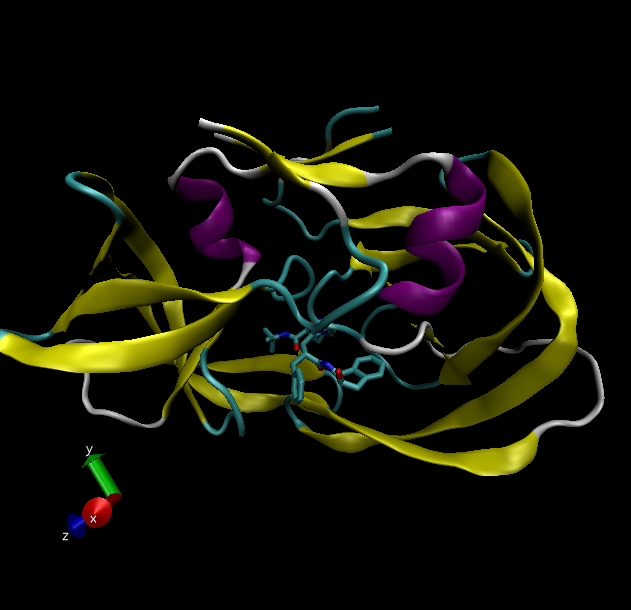
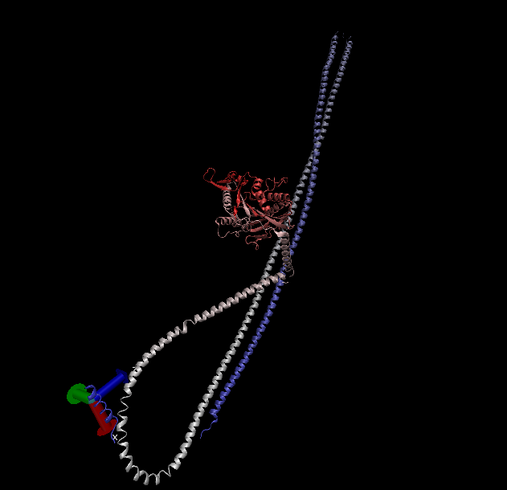

# The PDB Database

The PDB is the main repository for 3D structure data of biomolecules

Here we explore its composition. We obtained the most recent stats from https://www.rcsb.org/stats/summary

```{r}
tbl <- read.csv("Data Export Summary.csv", row.names =1)
tbl
```

>Q1: What percentage of structures in the PDB are solved by X-Ray and Electron Microscopy.

```{r}
tot.method <-colSums(tbl)
round(tot.method/tot.method["Total"]*100, 3)
```
87.197% are found by XRay and 5.354% are found by EM.

>Q2: What proportion of structures in the PDB are protein?

```{r}
ans <- tbl$Total[1]/sum(tbl$Total)*100
round(ans,3)
```
The answer to this question is `r round(ans,3)` % of total structures.

>Q3: Type HIV in the PDB website search box on the home page and determine how many HIV-1 protease structures are in the current PDB?


Here is the VMD generated image of HIV-protease, PDB code: 1hsg



## Bio3D package for structural bioinformatics

We will load the bio3d package.

```{r}
library(bio3d)

pdb <- read.pdb("1hsg")
pdb
```

```{r}
head(pdb$atom)
```

Extract the sequence for ADK:

```{r}
aa <- get.seq("1ake_A")
aa
```

```{r}
#blast <- blast.pdb(aa)
```

```{r}
#hits <- plot(blast)
```

```{r}
#hits$pdb.id
```


## Normal mode analysis (NMA)

```{r}
pdb <- read.pdb("1ake")
pdb
```
Trim to chain A only.

```{r}
chain <- trim.pdb(pdb,chain="A")
chain
```
Run  a bioinformatics method to predict the flexibility and "function motions" of this protein chain
```{r}
modes <- nma(chain)
```

```{r}
plot(modes)
```

```{r}
m7 <- mktrj.nma(modes, mode = 7, file="mode_7.pdb")
```

```{r}
pdb <- read.pdb("1ake")
chain<- trim.pdb(pdb, chain ="A")
modes <-nma(chain)
mktrj.nma(modes, mode = 7, file="mode_7.pdb")
```





